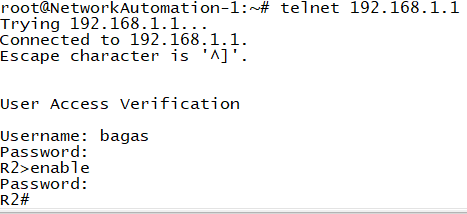

# All about Network Automation using Python
## Purpose
I create this repo for myself and people who are willing to learn Network Automation using Python. 
I use gns3 for the network emulation, and some appliances from gns3 marketplace
## Items provided here :
<ul>
<li>How to connect</li>
<li>VPN</li>
<li>to be continued</li>
</ul>

## How to connect

Set Up the topology like this below : 

Set up the Router Login configuration : 

Then try to connect manually : 

Then try to connect using python program : 

