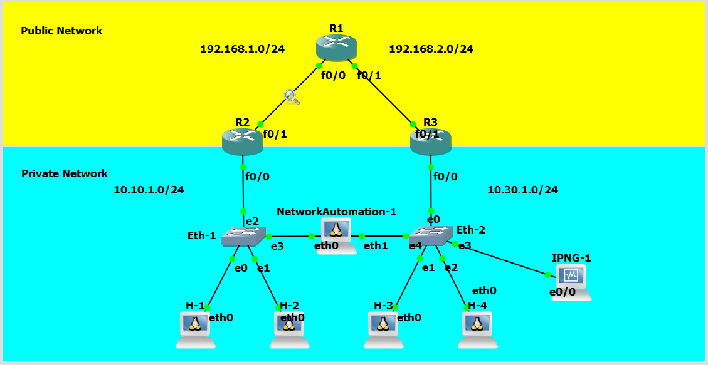
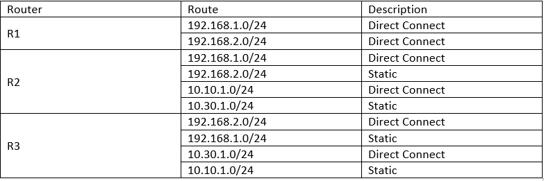
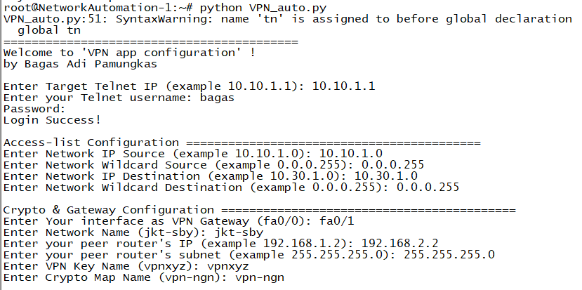
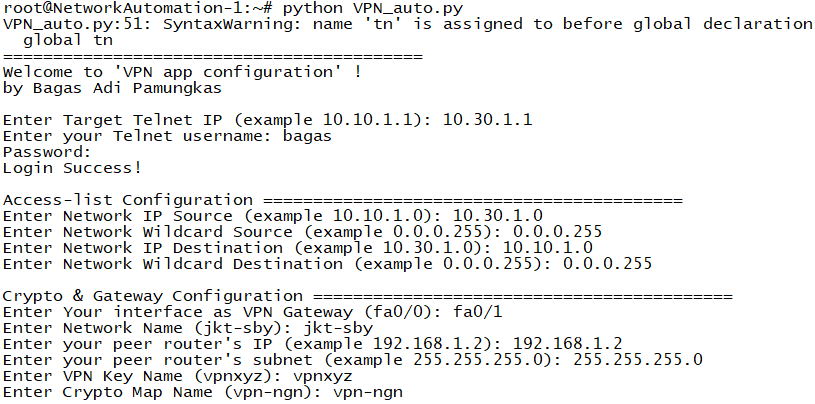
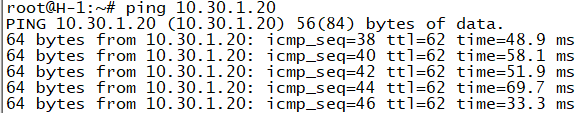
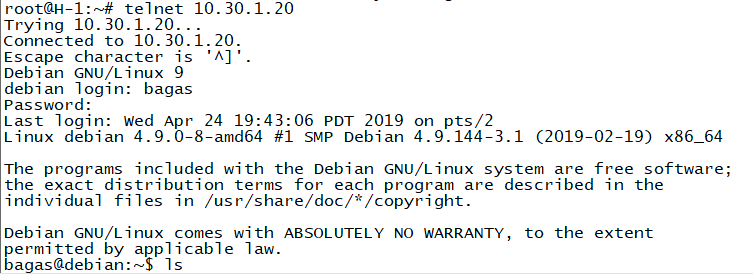
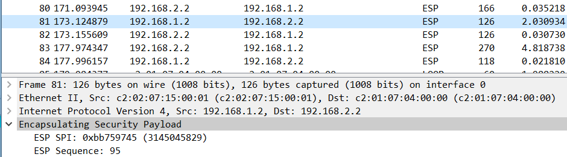

# VPN
## Introduction

The purpose of this project is <strong>to connect 2 private network using VPN via Public Network</strong>. Private network is not routed in Public Network, to connect the private networks VPN is needed. The VPN will be configured using python from NetworkAutomation PC.

STEP : 

<ol>
<li>R2 must be connected to R1 and R3</li>
<li>R3 must be connected to R1 and R2</li>
<li>R1 is a representation of Public Network Router that does not route to any private networks</li>
<li>R2 is configured with VPN to connect to R3 private networks</li>
<li>R3 is configured with VPN to connect to R2 private networks</li>
<li>Check the connection between private networks</li>
<li>Check the packet using wireshark, it must be encapsulated using Security Protocol (IPSec)</li>
</ol>

Set Up the topology like this below : 

Initial Configuration : 

Router R2 Configuration : 

Router R3 Configuration : 

Check connection between private networks : 

Check the packet using wireshark, it should be encapsulated with Security Protocols like below : 

